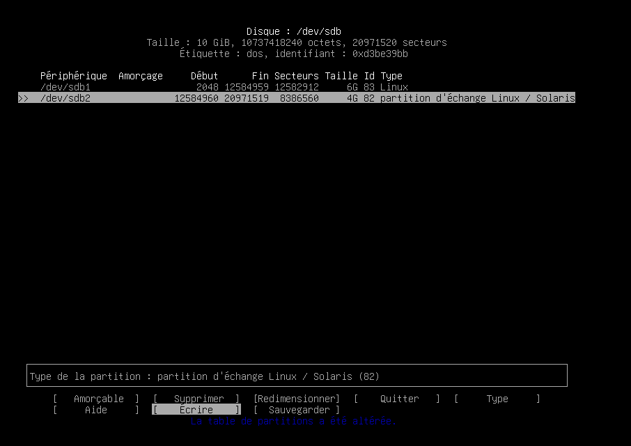
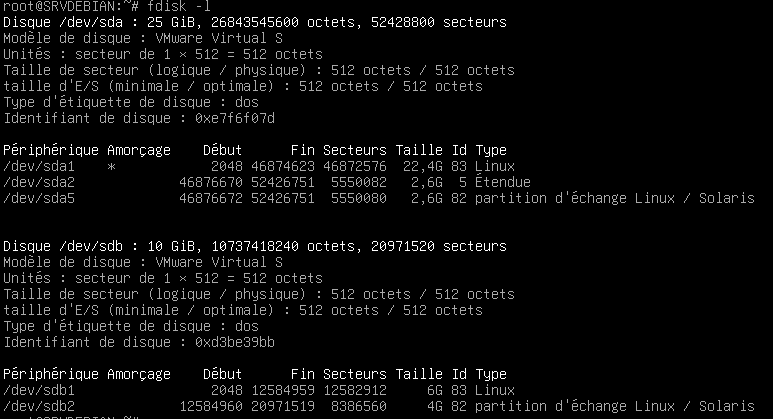
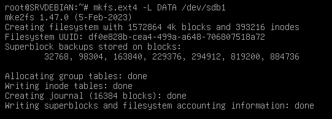
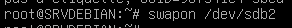
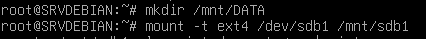
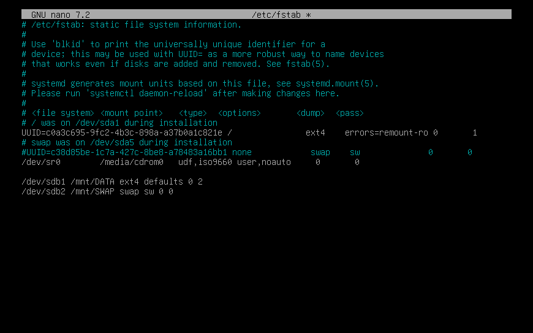

# Ajout des partitions sdb1 et sdb2

**utilisation de la commande cfdisk /dev/sdb**

**verification avec la commande fdisk -l**

# Formatage de la partitions sdb1

# activation du SWAP sdb2

# montage de la partition sdb1

# montage de la parttion swap et config fichier /etc/fstab

